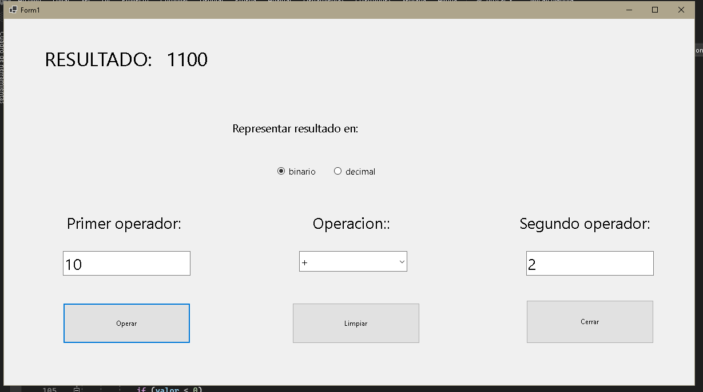

## Mi calculadora

* Mi calculadora es un ejercicio integrador hecho mediante c# y .net
#
#
#

* se realizan las operaciones basicas: + - * / y se pueden visualizar los resultados en decimal o en binario como se prefiera.
#
#
#
***

